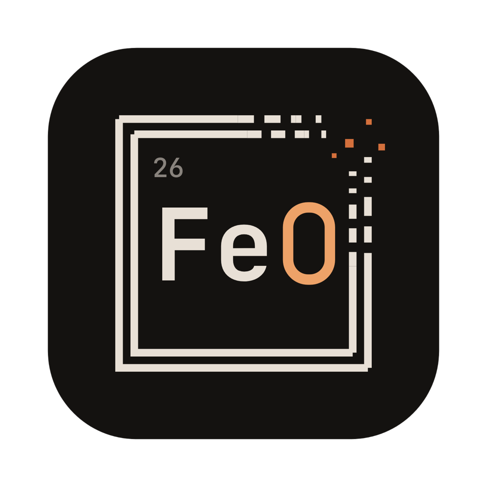

<p align="center">
  
</p>

<h1 align="center">Oxide</h1>

<p align="center">
  A native macOS terminal emulator, written entirely in Rust.<br/>
  <em>Rust is iron oxide. It's a whole thing.</em>
</p>

<p align="center">
  <a href="https://github.com/bobbycoleman-dev/oxide/actions/workflows/ci.yml"></a>
</p>

---

Oxide is a GPU-rendered terminal built on [GPUI](https://www.gpui.rs) (Zed's UI framework) and
[`alacritty_terminal`](https://crates.io/crates/alacritty_terminal) (Alacritty's PTY + VT parser),
with a file-tree drawer you drive like vim and a status bar that knows where your shell is.

## Features

- **Real terminal** — full VT emulation via Alacritty's parser: truecolor, wide glyphs and
  combining marks, bracketed paste, mouse reporting (SGR), alternate-screen scrolling, OSC 8
  hyperlinks, OSC 52 clipboard. vim, htop, and tmux just work.
- **File tree drawer** — follows the focused pane, so switching splits re-roots it to
  that shell's directory. Modeless vim navigation (`j`/`k`/`gg`/`G`, nvim-tree style `h`/`l`),
  type-to-filter with `/`, and file operations: `a` add, `r` rename, `d` delete (to Trash).
  Respects `.gitignore`, watches the filesystem, and follows the shell's `cd` automatically.
- **Scrollback search** — `cmd-f`, live and case-insensitive, `⏎`/`⇧⏎` to walk matches.
- **Prompt jumping** — `cmd-↑`/`cmd-↓` hop between previous prompts in scrollback.
- **Status bar** — cwd plus git branch, dirty state, and ahead/behind, rendered natively.
- **Configurable prompt** *(optional)* — compile a powerline prompt from TOML segments
  (`cwd`, `git`, `exit_status`, `time`, `duration`, …), injected without touching your
  dotfiles (ZDOTDIR shim for zsh, `--init-file` for bash), with OSC 133 semantic prompt
  markers. Or set `prompt.enabled = false` and keep your starship/p10k prompt as-is.
- **Themes** — `catppuccin-mocha`, `catppuccin-latte`, `gruvbox-dark`, `tokyonight`,
  `dracula`, `nord`, `solarized-dark`, and `oxide` (rust-toned, naturally). Any color
  individually overridable. Config reloads live.
- **Split panes** — split in any direction and nest freely; navigation moves by what's
  on screen, and `exit` or `ctrl-w q` closes a pane and reclaims its space.
- **Tabs** — a Zed-style in-app tab bar, so tabs work everywhere (including under
  tiling window managers). `cmd-t` opens one in the current directory or `~/`
  (`window.new_tab_directory`); `cmd-1..9` jump straight to a tab.
- **Workspaces** — named sets of tabs and splits, tmux-session style, managed from the
  drawer below the file tree (`a` add, `r` rename, `d` delete, `p` pin). Temporary by
  default; pinned ones survive restarts, restoring layout, tabs, splits, and each
  pane's directory with fresh shells.
- **The details** — window size/position persistence, `cmd-click` to open URLs, copy-on-select option, font size at runtime
  (`cmd +/-/0`), configurable bell, blinking cursor that pauses while you type.

## Requirements

- macOS (Apple Silicon or Intel)
- [Rust](https://rustup.rs) (2024 edition)
- Full Xcode with the Metal toolchain (GPUI compiles Metal shaders at build time):

  ```sh
  sudo xcode-select --switch /Applications/Xcode.app/Contents/Developer
  xcodebuild -downloadComponent MetalToolchain   # if the build asks for it
  ```
- A [Nerd Font](https://www.nerdfonts.com) (default config expects JetBrainsMono Nerd Font Mono)

## Build & install

```sh
git clone git@github.com:bobbycoleman-dev/oxide.git
cd oxide
cargo run                     # development

./scripts/bundle.sh           # release build -> target/Oxide.app (ad-hoc signed)
cp -R target/Oxide.app /Applications/

# optional CLI shim: `oxide [dir]` from any terminal
sudo cp scripts/oxide-cli /usr/local/bin/oxide && sudo chmod +x /usr/local/bin/oxide
```

The first build compiles GPUI and its Metal shaders — expect several minutes.

## Keys

| Keys | Action |
|---|---|
| `ctrl-w h` / `ctrl-w l` / `ctrl-w w` | focus tree / terminal / toggle |
| `cmd-b` | toggle the drawer |
| `ctrl-w t` / `cmd-shift-e` | focus the file tree from anywhere |
| `cmd-f` | search scrollback (`⏎` older, `⇧⏎` newer, `esc` close) |
| `cmd-↑` / `cmd-↓` | jump to previous / next prompt |
| `cmd-t` / `cmd-n` | new tab / new window |
| `cmd-1..9` | jump to tab |
| `⌃tab` / `⇧⌘[` `⇧⌘]` | previous / next tab |
| `ctrl-w p` | focus the workspaces panel (`tab` toggles tree ↔ workspaces) |
| `ctrl-w v` / `ctrl-w s` | split right / down (`⇧V` / `⇧S` for left / up) |
| `cmd-d` / `cmd-shift-d` | split right / down |
| `ctrl-w h` `j` `k` `l` | move between panes (`h` from the leftmost focuses the tree) |
| `cmd-opt-←↓↑→` | move between panes |
| `ctrl-w q` / `cmd-w` | close pane (closes the window when it's the last one) |
| `cmd-c` / `cmd-v` | copy / paste (bracketed) |
| `cmd +` / `-` / `0` | font size |

**In the tree** (bare keys are free — there's no text input to collide with):

| Keys | Action |
|---|---|
| `j` `k` `gg` `G` `ctrl-d` `ctrl-u` | move |
| `l` / `h` | expand & descend / collapse & ascend (nvim-tree semantics) |
| `enter` / `o` | open dir, or file in `$EDITOR` |
| `c` / `-` | re-root at selection / at parent (cd's the shell too) |
| `/` | filter (`esc` clears) |
| `a` / `r` / `d` | add (`dir/` with trailing slash) / rename / delete to Trash |
| `I` / `R` | toggle hidden / refresh |
| `esc` | dismiss input → clear filter → back to terminal |

**In the workspaces panel:**

| Keys | Action |
|---|---|
| `j` / `k` | move selection |
| `enter` / `o` | switch to workspace |
| `a` / `r` / `d` | add / rename / delete (`y` confirms) — also on right-click |
| `p` | pin — persist this workspace across restarts |
| `esc` | dismiss input → back to terminal |

## Configuration

`~/.config/oxide/config.toml` — a fully commented default is generated on first run.
Font and colors apply live; `[shell]` and `[prompt]` apply to new sessions.

```toml
[font]
family = "JetBrainsMono Nerd Font Mono"
size   = 14.0

[colors]
preset = "oxide"              # or override any color individually

[window]
new_tab_directory = "pwd"     # pwd | home

[tree]
follow_cwd = true             # tree re-roots when the shell cd's

[status_bar]
enabled  = true
position = "bottom"

[prompt]
enabled = false               # keep your own prompt (starship, p10k, ...)
```

## Architecture

One binary crate. The PTY reader/parser runs on its own thread
(`alacritty_terminal`'s event loop) and mutates a shared `Term` behind a mutex;
the GPUI main thread briefly locks it during paint to copy the visible grid out,
then shapes and paints batched text runs directly — no per-cell elements.
Directory scans, git queries, and file watching run on the background pool.
The tree follows `cd` by polling the PTY's foreground process group cwd
(`tcgetpgrp` + `proc_pidinfo`), so it works with zero shell cooperation.

## Known limitations

- No IME / dead-key composition yet (two-stroke accents, CJK input).
- Splits can't be resized yet; panes divide their space evenly.
- Pinned workspaces restore layout and directories with fresh shells; running
  programs can't survive a full quit (tmux only manages it because its server
  never exits).
- Left/right Option can't be distinguished; `option_as_meta` treats `left`/`right` as `both`.

## License

MIT — see [LICENSE](LICENSE).

Oxide builds on [GPUI](https://www.gpui.rs) and [`alacritty_terminal`](https://crates.io/crates/alacritty_terminal), both Apache-2.0.
