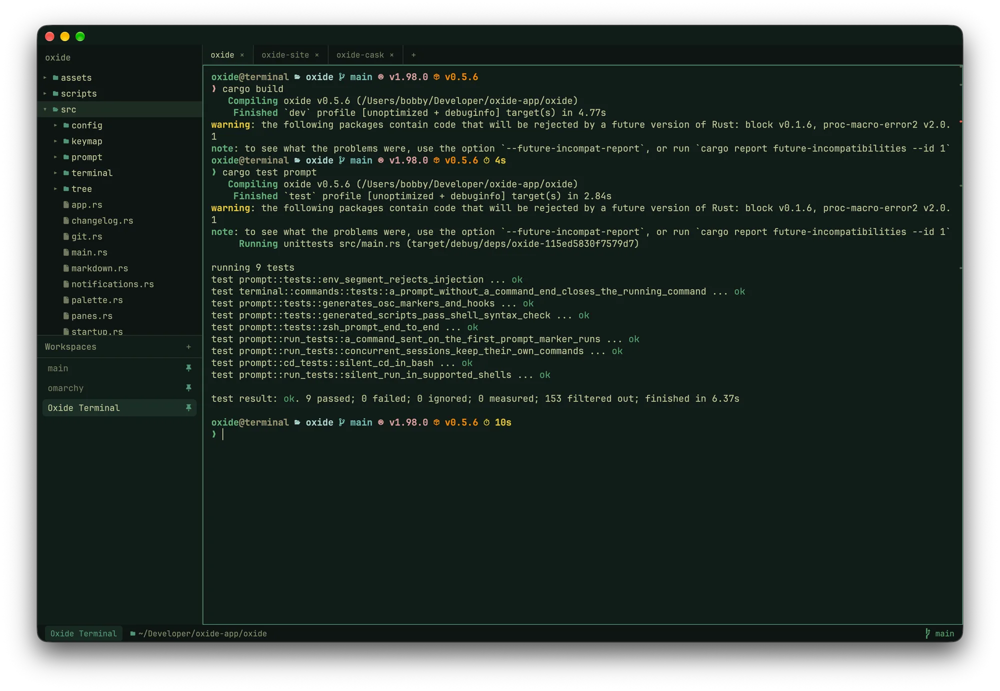
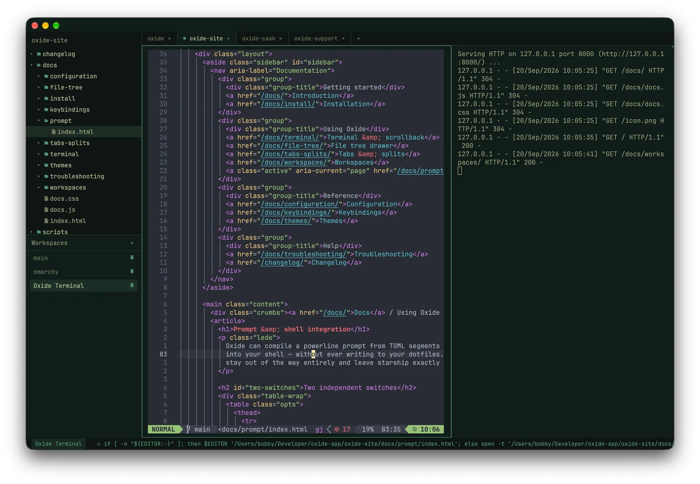
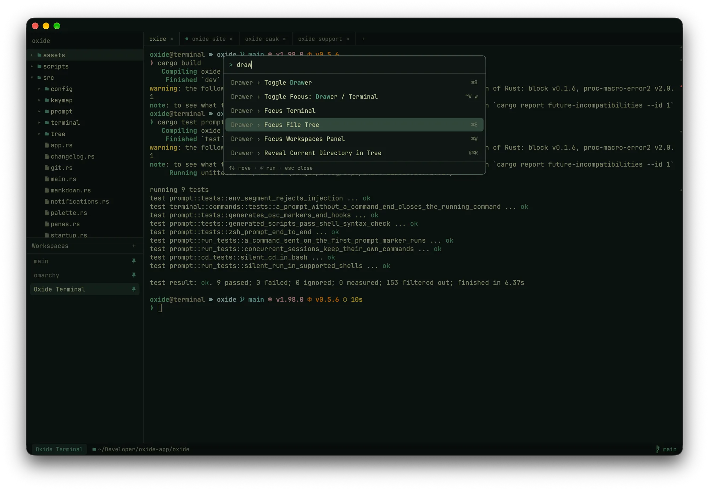
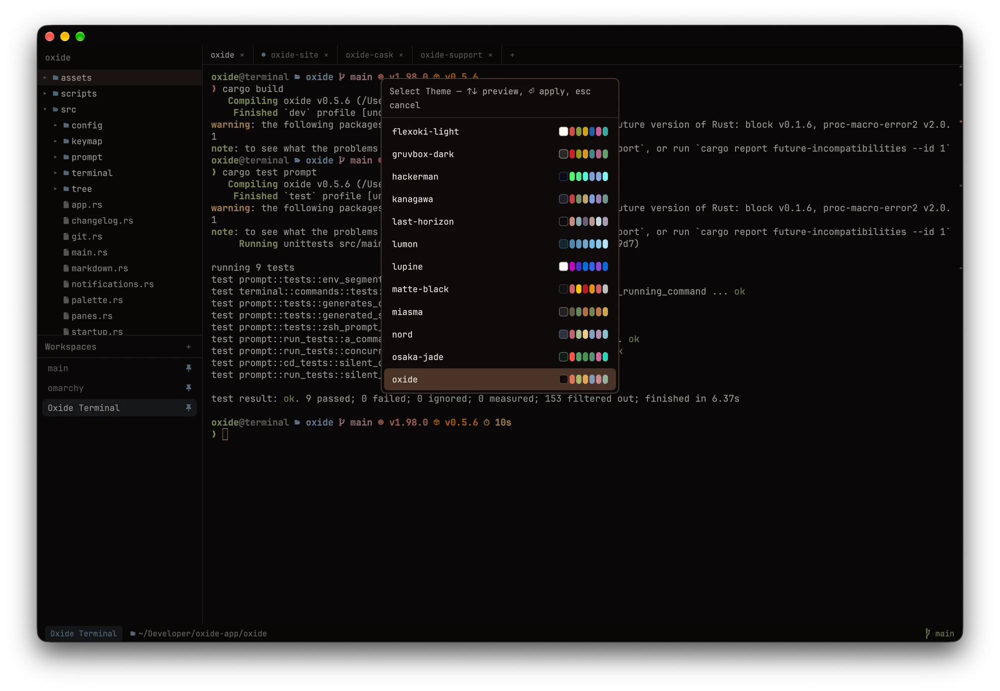
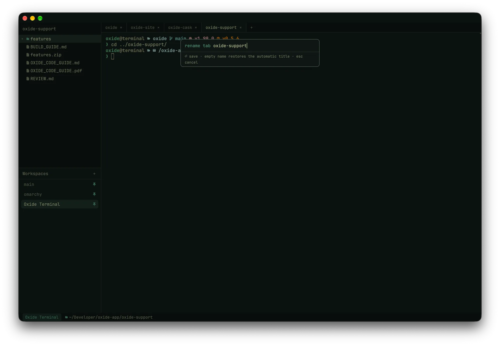

<p align="center">
  
</p>

<h1 align="center">Oxide Terminal</h1>
<p align="center">
  A native macOS terminal emulator, written entirely in Rust.<br/>
  <em>Rust is iron oxide. It's a whole thing.</em>
</p>

<p align="center">
  <a href="https://oxideterminal.com">Website</a> ·
  <a href="https://oxideterminal.com/docs/">Docs</a> ·
  <a href="https://oxideterminal.com/changelog/">Changelog</a> ·
  <a href="https://oxideterminal.com/compare/">Compare</a> ·
  <a href="https://discord.gg/APV9FYGgeh">Discord</a>
</p>

<p align="center">
  <a href="https://github.com/bobbycoleman-dev/oxide/releases/latest"></a>
  <a href="https://github.com/bobbycoleman-dev/oxide/actions/workflows/ci.yml"></a>
  <a href="LICENSE"></a>
  <a href="https://discord.gg/APV9FYGgeh"></a>
</p>

<p align="center">
  
</p>

Oxide is a GPU-rendered terminal built on [GPUI](https://www.gpui.rs) (Zed's UI framework) and
[`alacritty_terminal`](https://crates.io/crates/alacritty_terminal) (Alacritty's PTY + VT parser),
with a file-tree drawer you drive like vim and a status bar that knows where your shell is.
The things you'd normally bolt on — a file tree, tmux-style workspaces, a powerline prompt,
a vim copy mode — are built in, and all of it is configured in one TOML file that reloads
when you save. No account, no AI, no telemetry: the only thing Oxide asks the network is
whether GitHub has a newer release.

## Install

**macOS**

```sh
brew install --cask bobbycoleman-dev/tap/oxide-terminal
```

Or grab the DMG from the [latest release](https://github.com/bobbycoleman-dev/oxide/releases/latest)
and drag Oxide to Applications. Builds are Developer ID signed and notarized, so there's no
right-click-to-open dance, and Oxide keeps itself up to date afterwards — it checks on launch
and every six hours, or on demand via **Oxide → Check for Updates…**

**Linux** (Wayland or X11, x86_64)

```sh
# Arch and derivatives: the AUR package
yay -S oxide-terminal-bin

# any distro: the release tarball
tar xzf oxide-<version>-linux-x86_64.tar.gz
cd oxide-<version>-linux-x86_64 && ./install.sh        # into ~/.local, no root
```

The tarball is on the same [release page](https://github.com/bobbycoleman-dev/oxide/releases/latest).
`install.sh` puts `oxide` on your PATH and adds the launcher entry and icon;
`--prefix /usr/local` (with sudo) installs system-wide, `--uninstall` removes it.
Installed copies announce a newer release in the top-right corner; the AUR or the
tarball does the update.

- macOS 12 or later, Apple Silicon or Intel; or Linux with a Vulkan driver
  (any GPU from the last decade — Mesa's `vulkan-radeon` / `vulkan-intel`, or
  `nvidia-utils`) and `notify-send` (libnotify) for desktop notifications.
- No font to install — JetBrainsMono Nerd Font Mono is bundled. Set `font.family` to use your own.
- zsh or bash for the built-in prompt and shell integration. Other shells run fine and keep
  their own prompt.

Oxide never writes to your dotfiles. Full instructions are in the
[install docs](https://oxideterminal.com/docs/install/).

## A closer look

<table>
  <tr>
    <td width="50%"><br/><sub><b>Splits</b> — a file opened from the tree in <code>$EDITOR</code>, a dev server beside it.</sub></td>
    <td width="50%"><br/><sub><b>Command palette</b> (<code>cmd-shift-p</code>) — every action, fuzzy-searchable, with its binding.</sub></td>
  </tr>
  <tr>
    <td><br/><sub><b>Theme picker</b> (<code>cmd-alt-t</code>) — repaints the whole window as you move through it.</sub></td>
    <td><br/><sub><b>Rename a tab</b> with <code>ctrl-w ,</code> or a double-click; an empty name restores the automatic title.</sub></td>
  </tr>
</table>

## Features

The short tour. Every feature has a page in the [docs](https://oxideterminal.com/docs/).

- **Real terminal** — full VT emulation via Alacritty's parser: truecolor, wide glyphs and
  combining marks, bracketed paste, mouse reporting (SGR), alternate-screen scrolling, OSC 8
  hyperlinks, OSC 52 clipboard. vim, htop, and tmux just work.
- **File tree drawer** — follows the focused pane, so switching splits re-roots it to
  that shell's directory. Modeless vim navigation (`j`/`k`/`gg`/`G`, nvim-tree style `h`/`l`),
  type-to-filter with `/`, and file operations: `a` add, `r` rename, `m` move, `d` delete
  (to Trash).
  Dims gitignored files, watches the filesystem, and follows the shell's `cd` automatically.
- **The tree/terminal seam** — `y` inserts the selected path at the prompt, quoted and
  relative; `cmd-click` a `path:line:col` in output to open it in `$EDITOR` at that line
  (nvim, VS Code, emacs, Sublime, Helix dialects built in); rows are coloured by git status;
  `cmd-p` fuzzy-finds any file under the root; `cmd-shift-r` reveals the shell's directory;
  right-click a row to re-root, copy, or reveal in Finder — or, on a `.md` file, preview it
  rendered in a new tab (tables, highlighted code with click-to-copy); drag rows or drop files onto a pane.
- **Scrollback search** — `cmd-f`, live, `⏎`/`⇧⏎` to walk matches; regex, case-sensitive,
  and whole-word toggles as clickable chips (`cmd-alt-r` / `c` / `w`), and a malformed
  regex says so instead of matching nothing.
- **Copy mode** — `ctrl-w [` (or `cmd-shift-v`) turns the scrollback into a vim buffer:
  `hjkl`, `w b e`, `0 ^ $`, `gg G`, `ctrl-d/u`, counts like `5j`, `/` and `?` search with
  `n`/`N`, `v` / `V` / `ctrl-v` visual selection, `y` to yank and leave. Nothing typed
  reaches the shell until you `esc`.
- **Prompt jumping** — `cmd-↑`/`cmd-↓` hop between previous prompts in scrollback.
- **SSH awareness** — Oxide watches the foreground process: an `ssh` shows
  `ssh: host` in the status bar, and `[[ssh.hosts]]` patterns give a host an accent colour
  on the pane border so a production box is visibly red. The process name also titles
  the tab (`vim`, `cargo`, `ssh prod-web`).
- **Command awareness** — the shell integration's OSC 133 markers are read straight off the
  PTY, so Oxide knows what's running, how long it took, and whether it failed: elapsed time
  in the status bar, activity dots on tabs, a red flash on a background pane that failed, a
  failure gutter you can click to jump to the command, and desktop notifications for long or
  failed commands in panes you aren't watching (click to focus the pane).
- **Command history** — `cmd-r` searches every command run in any pane, with its directory
  and exit status; `⏎` inserts it at the prompt, `⌘⏎` runs it. `cmd-shift-c` copies the last
  command's output.
- **Status bar** — workspace, current tab (number or name, `status_bar.tab`), cwd plus git
  branch, dirty state, and ahead/behind, rendered natively.
- **Configurable prompt** *(optional)* — compile a powerline prompt from TOML segments
  (`cwd`, `git`, `exit_status`, `time`, `duration`, …), injected without touching your
  dotfiles (ZDOTDIR shim for zsh, `--init-file` for bash), with OSC 133 semantic prompt
  markers. Or set `prompt.enabled = false` and keep your starship/p10k prompt as-is.
- **Themes** — `catppuccin-mocha`, `catppuccin-latte`, `gruvbox-dark`, `tokyonight`,
  `dracula`, `nord`, `solarized-dark`, and `oxide` (rust-toned, naturally), plus the
  [Omarchy](https://omarchy.org/manual/themes/) set: `kanagawa`, `everforest`,
  `osaka-jade`, `matte-black`, `hackerman`, `rose-pine-dawn`, and a dozen more —
  25 presets in all. Any color
  individually overridable, including `selection_fg`. `follow_system = true` switches
  between a dark and a light preset with the macOS appearance. Config reloads live.
- **Split panes** — split in any direction and nest freely; navigation moves by what's
  on screen, and `exit` or `ctrl-w q` closes a pane and reclaims its space. Drag a
  divider or use `ctrl-w < > - + =` to resize. tmux reflexes: `ctrl-w z` zooms a pane
  to the full tab, `ctrl-w b` broadcasts typing to every pane in the tab (with a red
  border and a loud status-bar pill), `ctrl-w o` closes the others, `ctrl-w x` swaps with
  the neighbour. `window.inactive_pane_opacity` dims the panes you aren't in.
- **Command palette** — `cmd-shift-p` lists every action with its binding, fuzzy-searchable.
- **Configurable keys** — a `[keymap]` table in config.toml rebinds anything; typos get a
  toast with a suggestion, and a bare key that would steal from your shell is refused.
- **Toasts, not dialogs** — config errors, update problems, and other notices land as
  toasts in the bottom-right corner; click or `×` to dismiss. The first launch after an update
  shows one that opens the changelog in a new tab.
- **Tabs** — a Zed-style in-app tab bar, so tabs work everywhere (including under
  tiling window managers). `cmd-t` opens one in the current directory or `~/`
  (`window.new_tab_directory`); `cmd-1..9` jump straight to a tab. Double-click or
  `ctrl-w ,` to rename one (names survive with pinned workspaces), drag tabs to reorder,
  `cmd-shift-t` reopens the last closed one. Each tab carries its number
  (`tabs.show_numbers`), and the whole bar can be hidden — View → Toggle Tab Bar, or
  `tabs.enabled = false` — with the status bar still showing which tab you're on.
- **Workspaces** — named sets of tabs and splits, tmux-session style, managed from the
  drawer below the file tree (`a` add, `r` rename, `d` delete, `p` pin); `cmd-alt-1..9`
  jump straight to one. Temporary by
  default; pinned ones survive restarts, restoring layout, tabs, splits, and each
  pane's directory with fresh shells.
- **Startup commands** — the tmuxinator move: give a pane a command (`ctrl-w r`,
  prefilled with the last thing that ran there) and a pinned workspace re-runs it on
  restore, once that pane's shell is actually at a prompt. `on exit` per pane: back to
  the shell, close the pane, or restart with backoff (and a breaker after five quick
  exits). `e` in the workspaces panel edits every pane's command at once;
  `--no-startup-commands` or shift at launch restores the layout without running any.
- **The details** — window size/position persistence, `cmd-click` to open URLs, copy-on-select option, font size at runtime
  (`cmd +/-/0`), configurable bell, a `[cursor]` section (block / bar / underline, blink
  rate, unfocused look — and vim's per-mode DECSCUSR shapes are honoured), a font
  fallback list for CJK and emoji, a "2,340 lines above" pill while scrolled up, `cmd-k`
  to clear scrollback, and optional dimming of the whole window when another app is
  frontmost.

## Keys

The everyday ones. The [full keymap](https://oxideterminal.com/docs/keybindings/) lists every
action id, and a `[keymap]` table in your config rebinds any of them.

The `ctrl-w` chords are the same everywhere. Where macOS uses `cmd`, Linux uses
`ctrl-shift` (the usual terminal convention — plain `ctrl-c` stays the shell's) and
`alt-1..9` for tabs, because Super belongs to the window manager.

| macOS | Linux | Action |
|---|---|---|
| `ctrl-w h` / `ctrl-w l` / `ctrl-w w` | same | focus tree / terminal / toggle |
| `cmd-b` | `ctrl-shift-b` | toggle the drawer |
| `ctrl-w t` / `cmd-shift-e` | `ctrl-w t` / `ctrl-shift-e` | focus the file tree from anywhere |
| `cmd-f` | `ctrl-shift-f` | search scrollback (`⏎` older, `⇧⏎` newer, `esc` close; `cmd-alt-r` / `c` / `w` — `ctrl-alt-r` / `c` / `w` on Linux — toggle regex / case / whole word) |
| `ctrl-w [` / `cmd-shift-v` | `ctrl-w [` | copy mode — vim keys in the scrollback, `y` yanks, `esc` leaves |
| `cmd-k` | `ctrl-shift-k` | clear scrollback |
| `cmd-↑` / `cmd-↓` | `ctrl-shift-↑` / `↓` | jump to previous / next prompt |
| `cmd-r` | `ctrl-shift-r` | command history (`⏎` insert, `⌘⏎` / `ctrl-⏎` run) |
| `cmd-p` | `ctrl-shift-o` | fuzzy file finder (`⏎` open, `⌘⏎` / `ctrl-⏎` insert path, `⌥⏎` reveal) |
| `cmd-shift-r` | `ctrl-shift-alt-r` | reveal the shell's directory in the tree |
| `cmd-click` | `ctrl-click` | open a URL, or a `path:line` in `$EDITOR` |
| `cmd-shift-c` | `ctrl-shift-alt-c` | copy the last command's output |
| `cmd-t` / `cmd-n` | `ctrl-shift-t` / `ctrl-shift-n` | new tab / new window |
| `ctrl-w ,` / `cmd-shift-t` | `ctrl-w ,` / `ctrl-shift-alt-t` | rename tab (double-click works too) / reopen the last closed tab |
| `ctrl-w r` | same | set the pane's startup command (run when its pinned workspace is restored) |
| `cmd-1..9` | `alt-1..9` | jump to tab |
| `cmd-alt-1..9` | `ctrl-alt-1..9` | jump to workspace |
| `⌃tab` `⇧⌘]` / `⌃⇧tab` `⇧⌘[` | `ctrl-tab` `ctrl-pgdn` / `ctrl-shift-tab` `ctrl-pgup` | next / previous tab |
| `ctrl-w p` | same | focus the workspaces panel (`tab` toggles tree ↔ workspaces) |
| `ctrl-w v` / `ctrl-w s` | same | split right / down (`⇧V` / `⇧S` for left / up) |
| `cmd-d` / `cmd-shift-d` | — | split right / down |
| `ctrl-w h` `j` `k` `l` | same | move between panes (`h` from the leftmost focuses the tree) |
| `cmd-opt-←↓↑→` | — | move between panes |
| `ctrl-w q` / `cmd-w` | `ctrl-w q` / `ctrl-shift-w` | close pane (closes the window when it's the last one) |
| `ctrl-w <` `>` `-` `+` | same | resize the pane by a few cells (`ctrl-w =` equalises) |
| `ctrl-w z` / `ctrl-w b` | same | zoom the pane to the full tab / broadcast input to every pane in the tab |
| `ctrl-w o` / `ctrl-w x` | same | close the other panes / swap the pane with its neighbour |
| `cmd-shift-p` / `cmd-alt-t` | `ctrl-shift-p` / `ctrl-w shift-t` | command palette / theme picker |
| `cmd-c` / `cmd-v` | `ctrl-shift-c` / `ctrl-shift-v` | copy / paste (bracketed); Linux also pastes the primary selection on middle-click |
| `cmd +` / `-` / `0` | `ctrl +` / `-` / `0` | font size |
| `cmd-q` | `ctrl-shift-q` | quit |

<details>
<summary><b>In the tree</b> — bare keys are free; there's no text input to collide with</summary>

| Keys | Action |
|---|---|
| `j` `k` `gg` `G` `ctrl-d` `ctrl-u` | move |
| `l` / `h` | expand & descend / collapse & ascend (nvim-tree semantics) |
| `enter` / `o` | open dir, or file in `$EDITOR` |
| `y` / `Y` | insert the path at the prompt (relative / absolute) |
| `cmd-c` (`ctrl-shift-c`) | copy the path |
| `cmd-shift-o` (`ctrl-shift-o`) | reveal in Finder / the file manager |
| `c` / `-` | re-root at selection / at parent (cd's the shell too) |
| `/` | filter (`esc` clears) |
| `a` / `r` / `m` / `d` | add (`dir/` with trailing slash) / rename / move / delete to Trash |
| `I` / `R` | toggle hidden / refresh |
| `esc` | dismiss input → clear filter → back to terminal |

</details>

<details>
<summary><b>In copy mode</b> — <code>ctrl-w [</code>; keys never reach the shell</summary>

| Keys | Action |
|---|---|
| `h` `j` `k` `l`, arrows | move the cursor (counts work: `5j`) |
| `w` `b` `e` / `W` `B` `E` | word motions (punctuation-aware / whitespace) |
| `0` `^` `$` / `gg` `G` / `H` `M` `L` | line / buffer / screen positions |
| `ctrl-d` `ctrl-u` / `ctrl-f` `ctrl-b` | half page / full page |
| `/` `?` then `n` `N` | search forward / backward, repeat — same bar and toggles as `cmd-f` |
| `v` `V` `ctrl-v` | character / line / block selection |
| `y` / `yy` / `⏎` | yank the selection (or the line) and leave |
| `esc` / `q` | clear the selection, then leave |

</details>

<details>
<summary><b>In the workspaces panel</b></summary>

| Keys | Action |
|---|---|
| `j` / `k` | move selection |
| `enter` / `o` | switch to workspace |
| `a` / `r` / `d` | add / rename / delete (`y` confirms) — also on right-click |
| `p` | pin — persist this workspace across restarts |
| `e` | edit every pane's startup command — also on right-click |
| `esc` | dismiss input → back to terminal |

</details>

## Configuration

`~/.config/oxide/config.toml` — a fully commented default is generated on first run.
Font, colors, keys, and notifications apply live; `[shell]` and `[prompt]` apply to new
sessions. [Every option, with defaults →](https://oxideterminal.com/docs/configuration/)

```toml
[font]
family = "JetBrainsMono Nerd Font Mono"
size   = 14.0

[colors]
preset = "oxide"              # or override any color individually
follow_system = true          # ...or switch between preset_dark / preset_light with macOS
preset_light  = "catppuccin-latte"

[cursor]
style = "bar"                 # block | bar | underline

[window]
new_tab_directory = "pwd"     # pwd | home
inactive_pane_opacity = 0.8   # dim the panes you aren't in

[[ssh.hosts]]
match  = "*.prod.example.com" # red border while ssh'd into prod
accent = "#f38ba8"

[tree]
follow_cwd = true             # tree re-roots when the shell cd's
open_on_startup = true        # false starts with the drawer hidden (cmd-b shows it)

[status_bar]
enabled  = true
position = "bottom"
tab      = "number"           # number | name — the current-tab chip

[tabs]
enabled      = true           # false hides the tab bar
show_numbers = true           # small position number on each tab

[prompt]
enabled = false               # keep your own prompt (starship, p10k, ...)

[keymap]
"cmd-j" = "pane::split_down"  # keystroke = "action id"; "" unbinds
```

## Build from source

You'll need [Rust](https://rustup.rs) (2024 edition). On macOS, also full Xcode with the Metal
toolchain — GPUI compiles Metal shaders at build time:

```sh
sudo xcode-select --switch /Applications/Xcode.app/Contents/Developer
xcodebuild -downloadComponent MetalToolchain   # if the build asks for it
```

On Linux, the GPUI build dependencies (Arch shown; Debian/Ubuntu equivalents are in
`.github/workflows/ci.yml`):

```sh
sudo pacman -S --needed base-devel fontconfig freetype2 libxkbcommon libxkbcommon-x11 \
  libxcb wayland vulkan-icd-loader libnotify
```

```sh
git clone https://github.com/bobbycoleman-dev/oxide.git
cd oxide
cargo run                     # development

# macOS
./scripts/bundle.sh           # release build -> target/Oxide.app (ad-hoc signed)
cp -R target/Oxide.app /Applications/
sudo cp scripts/oxide-cli /usr/local/bin/oxide && sudo chmod +x /usr/local/bin/oxide   # optional `oxide [dir]` shim

# Linux
./scripts/linux-package.sh    # release build -> target/oxide-<version>-linux-<arch>.tar.gz
tar xzf target/oxide-*-linux-*.tar.gz -C /tmp && /tmp/oxide-*-linux-*/install.sh
```

The first build compiles GPUI — expect several minutes. A `cargo run` binary is a debug
build: fine for poking at a change, but a full-screen program like nvim will feel sluggish
in it (an unoptimised GPUI redraw doesn't fit in a 60 Hz frame; the release build uses a
quarter of the CPU). It also never checks for updates, and on macOS it isn't an app bundle,
so its notifications can't be clicked. Use `scripts/bundle.sh` / `scripts/linux-package.sh`
for the real thing. Cutting a release is covered in
[RELEASING.md](RELEASING.md).

## Architecture

One binary crate. The PTY reader/parser runs on its own thread
(`alacritty_terminal`'s event loop) and mutates a shared `Term` behind a mutex;
the GPUI main thread briefly locks it during paint to copy the visible grid out,
then shapes and paints batched text runs directly — no per-cell elements.
Directory scans, git queries, and file watching run on the background pool.
The tree follows `cd` by polling the PTY's foreground process group cwd
(`tcgetpgrp` + `proc_pidinfo` on macOS, `/proc/<pid>/cwd` on Linux), so it works
with zero shell cooperation. Platform differences are confined to a handful of
`cfg` sites: the process lookups, notifications (`UNUserNotificationCenter` /
`notify-send`), the updater, the keymap tables, and the window chrome.

## Known limitations

- No IME / dead-key composition yet (two-stroke accents, CJK input).
- Narrowing a pane past the width of a multi-line bash prompt can scroll the prompt's
  first line into scrollback until the next prompt is drawn (`enter` brings it back).
- Pinned workspaces restore layout and directories with fresh shells; running
  programs can't survive a full quit (tmux only manages it because its server
  never exits). Startup commands are the workaround: declare what a pane runs
  and it's re-run on restore. `on_exit` needs shell integration with zsh or
  bash; other shells get the command typed in and nothing more.
- Left/right Option can't be distinguished; `option_as_meta` treats `left`/`right` as `both`.
- Linux: `bell = "sound"` falls back to the visual flash; there's no in-place
  self-update (the pill opens the release page); `window.titlebar` is ignored — the
  compositor owns decorations, and under a compositor without server-side
  decorations (GNOME) the window has none; Oxide can't yet be an
  `xdg-terminal-exec` target because it has no `-e command` flag.

## Community

Questions, ideas, or just want to see what's coming? Join the
[Oxide Terminal Discord](https://discord.gg/APV9FYGgeh). Bugs and feature requests go in
[issues](https://github.com/bobbycoleman-dev/oxide/issues/new) — **Help → Report an Issue** in
the menu bar goes to the same place. Wondering how Oxide stacks up against iTerm2, Ghostty,
kitty, WezTerm, Alacritty, or Warp? There's an [honest comparison](https://oxideterminal.com/compare/).

If Oxide earns a place in your dock, you can [buy me a coffee](https://www.buymeacoffee.com/bobbycoleman).

## License

MIT — see [LICENSE](LICENSE).

Oxide builds on [GPUI](https://www.gpui.rs) and [`alacritty_terminal`](https://crates.io/crates/alacritty_terminal), both Apache-2.0.
